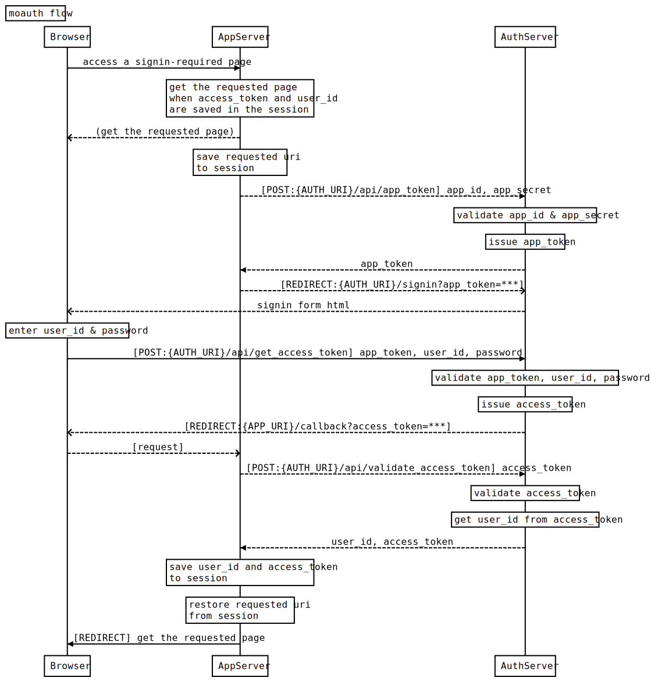
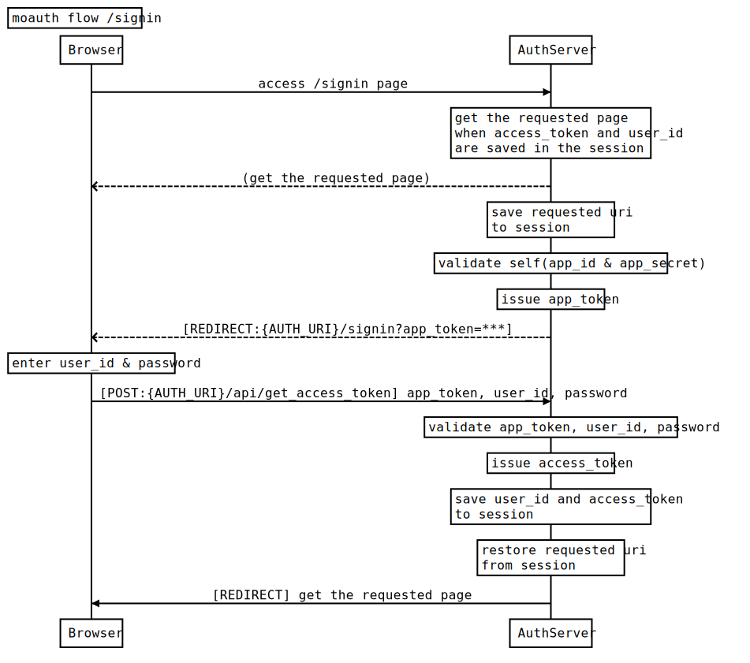

# MOauth
simple oauth communication helper

## required
- mongodb: oauth server need mongodb.

## install
`npm install git+https://github.com/maruyu998/MOauth.git`

## sequence diagram
Flow in client application auth


Flow in server self auth


## usage
### client
```
const express = require('express')
const session = require('express-session')
const config = require('config')

const moauth = new (require('MOauth').client)({
  app_token_issue_server_uri: `${config.authserver}/api/get_app_token`,
  user_signin_server_uri: `${config.authserver}/signin`,
  access_token_validate_server_uri: `${config.authserver}/api/validate_access_token`,
  callback_path: '/callback',
  app_id: config.app_id, 
  app_secret: config.app_secret
})

const app = express()
app.use(express.json())
app.use(express.urlencoded({ extended: false }))
app.use(session({
  secret:config.SESSION_SECRET,
  rolling : true,
  name: config.appid,
  cookie: { 
    secure:false, 
    httpOnly:false, 
    maxAge: 3*60*60*1000,
  }
}))
app.get('/callback', moauth.redirect_requested_page_from_callback_path)
app.use(moauth.redirect_signin_page_if_not_login)
app.use(express.static(config.client.static))
```

### server (example base)
```
const express = require('express')
const session = require('express-session')
const config = require('config')
require('date-utils')
const { MongoClient } = require('mongodb')

;(async ()=>{
  const app = express()
  app.use(express.json())
  app.use(express.urlencoded({ extended: false }))
  app.use(cookieParser())
  app.use(session({
    secret:config.SESSION_SECRET,
    rolling : true,
    name: config.app_id,
    cookie: { 
      secure:false, 
      httpOnly:false, 
      maxAge: 3*60*60*1000,
    }
  }))
  const { mongo_connect } = config
  const mongo_collection = await (
    mongo_connect.authflg ? new MongoClient('mongodb://' + mongo_connect.address, {
        authSource: mongo_connect.authDatabase,
        auth: {user: mongo_connect.user, password: mongo_connect.password},
        useUnifiedTopology: true
      }) : new MongoClient('mongodb://' + mongo_connect.address, { useUnifiedTopology: true })
    ).connect()
    .then(async mongoClient => mongoClient.db(config.mongo_dbname).collection('all'))

  const moauth = new (require('MOauth').server)({
    mongo_collection,
    hash_salt: config.HASHSALT,
    user_signin_server_path: '/signin/',
    app_id: config.app_id, 
    app_secret: config.app_secret
  })

  app.use('/waiting/', moauth.require_signin)
  app.use('/waiting/', express.static('public/waiting/'))
  app.use('/app_register/', moauth.require_signin, express.static('public/app_register/'))

  app.use('/signin/', moauth.redirect_to_added_app_token_uri, express.static('public/signin/'))
  app.use(express.static('public'))
  app.post('/api/get_app_token', moauth.issue_and_send_app_token)
  app.get('/api/get_user_info', moauth.get_signed_in_user_info)
  app.post('/api/signup_user', moauth.signup_user)
  
  app.post('/api/get_access_token', moauth.get_access_token)
  app.post('/api/validate_access_token', moauth.validate_access_token)
  app.post('/api/app_register', moauth.require_signin, moauth.app_register)
  app.get('/api/get_waitings', moauth.require_signin, moauth.get_waitings)
  app.post('/api/review_waiting', moauth.require_signin, moauth.review_waiting)

  app.listen(config.serveport, function () {
    console.log(`server starting -> [port] ${config.serveport} [env] ${process.env.NODE_ENV}`)
  })
})()
process.on('unhandledRejection', (reason, p) => {
  console.log('Unhandled Rejection at: Promise', p, 'reason:', reason);
})

```